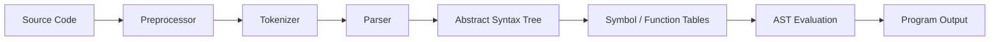

# LogComp — Interpreter Version 2.4.0

Academic compiler-construction project developed in **2023** during my Computer Engineering studies at **Insper**.

This branch contains the **Version 2.4.0 interpreter** of LogComp, a small language-processing project written in Python with Go-like syntax.

Unlike the later `main` branch, which focuses on x86 assembly generation, this version evaluates the program directly from its abstract syntax tree.

## Architecture

A simplified view of the interpreter pipeline:


```mermaid
flowchart LR
    SRC[Source Code] --> PRE[Preprocessor]
    PRE --> TOK[Tokenizer]
    TOK --> PARSER[Parser]
    PARSER --> AST[Abstract Syntax Tree]
    AST --> ST[Symbol / Function Tables]
    ST --> EVAL[AST Evaluation]
    EVAL --> OUT[Program Output]
```

## Language Features

Version 2.4.0 includes support for:

- `int` and `string` values;
- variable declaration and assignment;
- arithmetic expressions;
- logical and relational expressions;
- string concatenation;
- `if / else` conditionals;
- `for` loops;
- `Println` and `Scanln`;
- user-defined functions;
- function arguments and calls;
- `return` statements;
- basic type checking during evaluation.

## Main Components

| File | Role |
| --- | --- |
| `main.py` | Preprocessing, recursive-descent parser and program entry point |
| `Tokenizer.py` | Lexical analysis and token generation |
| `AST.py` | AST node definitions and direct program evaluation |
| `SymbolTable.py` | Variable storage and type information |
| `FuncTable.py` | Function storage and lookup |

## Execution Model

The parser builds an abstract syntax tree from the input source code. The AST is then evaluated directly in Python.

Variables are stored in a symbol table, while function definitions are registered in a separate function table. Function calls create their own symbol table for parameters and local evaluation.

## Example

A LogComp program follows a Go-like syntax:

```go
var x int
var y int

x = 3 + 1
y = x

if x > 1 {
    y = y + 1
}

for x = 0; x < 3; x = x + 1 {
    Println(x)
}
```

Run a source file with:

```bash
python main.py arquivo.go
```

## Project Evolution

This branch represents the interpreter stage of the original project.

The repository's `main` branch contains a later stage focused on generating **32-bit x86 assembly** instead of directly evaluating the AST.

[View the assembly-generation version on `main`](https://github.com/keiyanishio/LogComp/tree/main)

## Technologies and Concepts

**Python · Compiler Construction · Lexical Analysis · Recursive-Descent Parsing · AST · Symbol Tables · Function Tables · Type Checking · Interpreters**

## Historical Context

This branch preserves the original Version 2.4.0 implementation. The portfolio refresh changes only the documentation; the interpreter source code remains unchanged.
