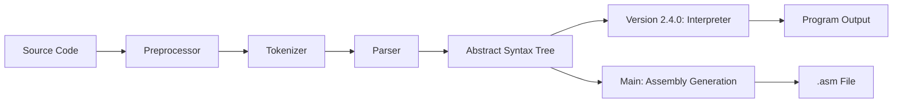

# LogComp — Interpreter and x86 Assembly Generator

Academic language-processing project developed in **2023** during my Computer Engineering studies at **Insper**.

LogComp is implemented in **Python** and processes a small language with Go-like syntax. The project evolved in two directions: a feature-rich interpreter and a later stage focused on generating x86 assembly.

## Project Evolution

The repository preserves two important versions:

| Branch | Purpose |
| --- | --- |
| [`version-2.4.0`](https://github.com/keiyanishio/LogComp/tree/version-2.4.0) | Interpreter version with functions, type handling and direct AST evaluation |
| [`main`](https://github.com/keiyanishio/LogComp/tree/main) | Later compiler stage focused on generating assembly code |

The two branches represent different stages of the original academic project rather than one simply replacing the other.

## Architecture

A simplified view of the shared front end and the two execution paths:


```mermaid
flowchart LR
    SRC[Source Code] --> PRE[Preprocessor]
    PRE --> TOK[Tokenizer]
    TOK --> PARSER[Parser]
    PARSER --> AST[Abstract Syntax Tree]

    AST --> INT[Version 2.4.0: Interpreter]
    AST --> ASM[Main: Assembly Generation]

    INT --> OUT1[Program Output]
    ASM --> OUT2[.asm File]
```

## Version 2.4.0 — Interpreter

The `version-2.4.0` branch evaluates the AST directly in Python.

Its implementation includes:

- lexical analysis and tokenization;
- recursive-descent parsing;
- abstract syntax tree evaluation;
- symbol and function tables;
- `int` and `string` values;
- variable declaration and assignment;
- arithmetic, logical and relational expressions;
- string concatenation;
- `if / else` conditionals;
- `for` loops;
- `Println` and `Scanln`;
- function declarations, arguments, calls and `return`.

Run an input file with:

```bash
git checkout version-2.4.0
python main.py arquivo.go
```

## Main Branch — Assembly Generation

The `main` branch represents a later project stage in which AST evaluation was adapted to emit **32-bit x86 assembly**.

The code-generation layer writes instructions using registers such as `EAX`, `EBX` and `EBP`, stack-based variable storage, comparisons and jump labels. The generated assembly also includes integration with `printf` and `scanf` for basic I/O.

The current branch contains generation paths for:

- integer arithmetic;
- logical and relational operations;
- variable declaration, assignment and access;
- loop control flow;
- conditional control flow;
- input and output;
- generation of a `.asm` file from the source program.

Example:

```bash
python main.py teste1.go
```

This generates an assembly file with the same base name:

```text
teste1.go  →  teste1.asm
```

## Main Components

| File | Role |
| --- | --- |
| `main.py` | Preprocessing, recursive-descent parser and program entry point |
| `Tokenizer.py` | Lexical analysis and token generation |
| `AST.py` | AST nodes, evaluation logic and assembly generation |
| `SymbolTable.py` | Variable storage and symbol metadata |
| `FuncTable.py` | Function table used by the `version-2.4.0` interpreter |
| `start.txt` / `end.txt` | Assembly prologue and epilogue used by the `main` branch |
| `template.asm` | Historical assembly reference/template |
| `imgs/` | Grammar and development artifacts from the original project |

## Example Source

The language uses a compact Go-like syntax:

```go
var x int
var y int

x = 3 + 1
y = x

if x > 1 {
    x = 5 - 1
}

for x = 3; x < 5; x = x + 1 {
    y = x - 1
}

Println(x)
```

## Technologies and Concepts

**Python · Compiler Construction · Lexical Analysis · Recursive-Descent Parsing · AST · Symbol Tables · Type Checking · x86 Assembly**

## Historical Context

This repository preserves the original academic implementation and its branch-based evolution. The portfolio refresh focuses on documenting what each version represents; the compiler/interpreter code itself has not been rewritten or modernized.
