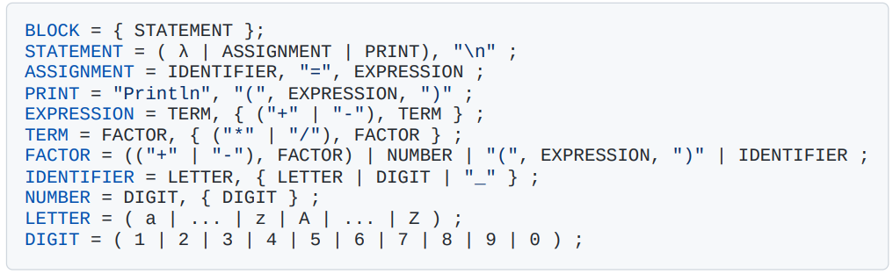

# Compilador LogComp


This is a simple compiler written in Python that can read files written in Go and generate the corresponding output.

## Usage
```
python main.py file.go
```

## Roteiro 5


## Roteiro 6


## EBNF-Roteiro 5

